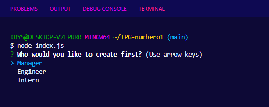
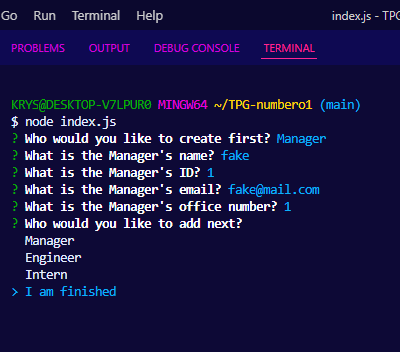
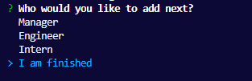
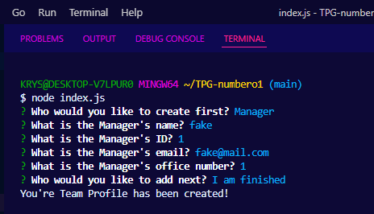
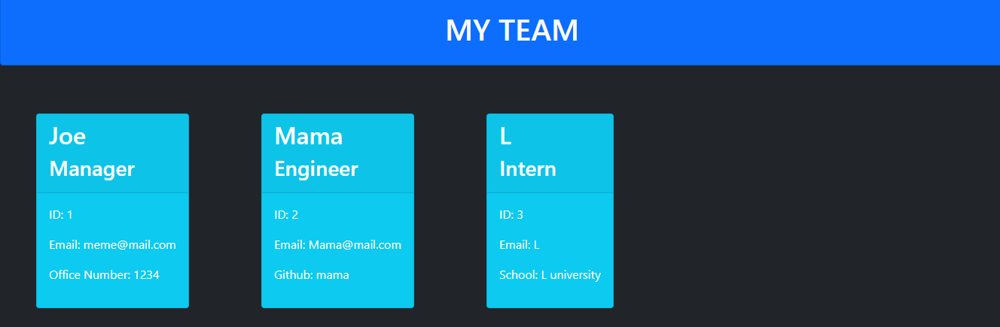

# TPG-numbero1

## Description 
   The Team Project Generator(TPG) generates an html of a team you put together through node.js.
## Table of Contents
 * [Usage](#usage)
 * [Questions](#questions)
 * [License](#license)
            
            

            
## Usage 
You can use this app to quickly and effeciently create a team with different types of roles. To begin select a starting profile.

Once you selected a starting profile you will be asked specific questions to the profile selected. 

Once finished with the questions you will have a selection menu to choose from. 

If you are finished building your team profile select 'I am finshed' and an index.html will be generated with you team profiles.

Here is a quick demo of how to do it and preview of the site.

## License
MIT License

Copyright (c) 2022 Krystopher Quintero

Permission is hereby granted, free of charge, to any person obtaining a copy
of this software and associated documentation files (the "Software"), to deal
in the Software without restriction, including without limitation the rights
to use, copy, modify, merge, publish, distribute, sublicense, and/or sell
copies of the Software, and to permit persons to whom the Software is
furnished to do so, subject to the following conditions:

The above copyright notice and this permission notice shall be included in all
copies or substantial portions of the Software.

THE SOFTWARE IS PROVIDED "AS IS", WITHOUT WARRANTY OF ANY KIND, EXPRESS OR
IMPLIED, INCLUDING BUT NOT LIMITED TO THE WARRANTIES OF MERCHANTABILITY,
FITNESS FOR A PARTICULAR PURPOSE AND NONINFRINGEMENT. IN NO EVENT SHALL THE
AUTHORS OR COPYRIGHT HOLDERS BE LIABLE FOR ANY CLAIM, DAMAGES OR OTHER
LIABILITY, WHETHER IN AN ACTION OF CONTRACT, TORT OR OTHERWISE, ARISING FROM,
OUT OF OR IN CONNECTION WITH THE SOFTWARE OR THE USE OR OTHER DEALINGS IN THE
SOFTWARE.
            
  ## Questions
  For questions you can contact me here on [GitHub](https://github.com/KrystopherQ).
